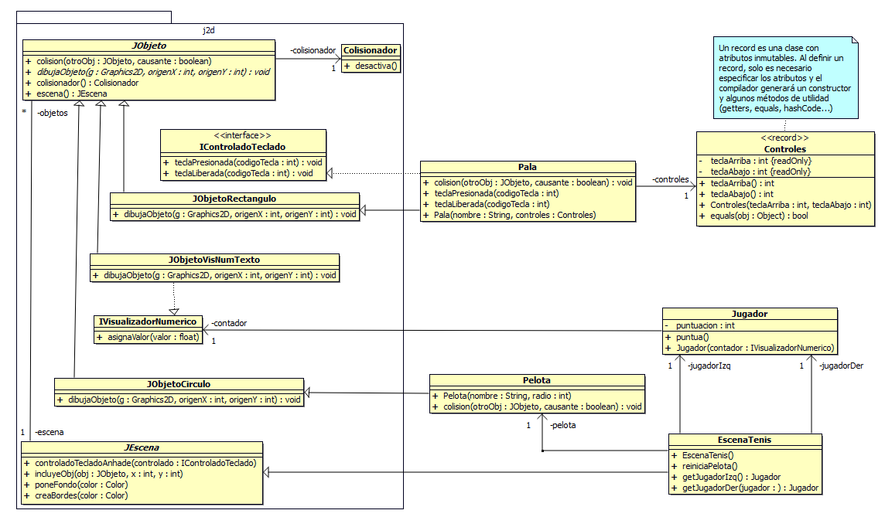

[captura]: resources/screenshot.png

# Tenis

![captura][]

## Clases de J2d


- **`JEscena`**: Clase abstracta que representa cada uno de las ecenas, niveles o pantallas de un juego. Contiene métodos para incluir, eliminar o buscar objetos de la clase `JObjeto`. Para crear nuestras propias escenas, debemos extender esta clase e implementar el comportamiento deseado.

- **`JObjeto`**: Clase abstracta que representa un objeto de J2d. Cada instancia tiene un nombre, una posición y una representación gráfica implementada por las subclases de `JObjeto`. Todos los JObjetos tienen asociado un `Colisionador` que es utilizado por las físicas del juego. Si se detecta que dos colisionadores están superpuestos, generalmente, los objetos asociados dejarán de moverse y se lamará al método `colision`, el cual podemos sobrescribir para definir comportamientos adicionales.

- **`Juego`**: clase no instanciable que representa el juego y que contiene métodos estáticos para manipular escenas, iniciar el juego o configurar parámetros del motor.

- **`IControladoTeclado`**: interfaz utilizada para gestionar la entrada del teclado. Será implementada por todos los objetos que respondan al teclado, los cuales deberemos registrar en la escena activa con el método `controladoTecladoAnhade` para que se llame a los métodos de la interfaz cuando se produzcan eventos.

## Clases del juego

En este proyecto, se extienden subclases de `JObjeto` que implementan el dibujo de primitivas sencillas: `JObjetoRectangulo` y `JObjetoCirculo`. Además, utilizaremos `JObjetoVisNumTexto` para mostrar contadores con la puntuación en la pantalla.



## Funcionamiento

Para iniciar el juego, simplemente es necesario llamar al método `anhadeEscena` pasándole como argumento una instancia de una subclase que extienda `JEscena` (en nuestro caso `EscenaTenis`) y llamar al método `jugar`, que contiene el bucle de juego.

```java
public class JuegoTenis {
	public static void main(String[] args) {
		EscenaTenis escena = new EscenaTenis();
		Juego.anhadeEscena(escena);
		Juego.jugar();
	}
}
```

En este caso, como no se prevee reutilizar la clase para crear múltiples escenas, el constructor de `JEscena` prepara la escena con todos los objetos necesarios para el juego:

- Fondo y bordes: con los métodos `poneFondo` se crea un fondo negro (por defecto, el fondo es blanco) y `creaBordes` se encarga de generar unos bordes con los que la pelota rebotará. Los nombres de los bordes son escena

- Contadores: se instancian dos objetos `JObjetoVisNumTexto` y se posicionan en las esquinas de la pantalla utilizando el método `incluyeObjCentrado`, que es un _wrapper_ para `incluyeObjeto`.

```java
	/**
	 * Incluye el objeto en la escena con su centro en las coordenadas
	 * indicadas.
	 * @param obj objeto a incluir.
	 * @param centroX coordenada x en la que se situa el centro del objeto.
	 * @param centroY coordenada y en la que se situa el centro del objeto.
	 * @throws ObjetoYaEnEscena si el objeto ya se encuentra incluido en la
	 * escena.
	 */
	public final synchronized void incluyeObjCentrado(JObjeto obj,
			int centroX, int centroY) throws ObjetoYaEnEscena {
		incluyeObj(obj, centroX - obj.anchoX() / 2, centroY - obj.altoY() / 2);
	}
```
- Jugadores: son dos objetos `Jugador`, cada uno asociado a un contador, que llevan la cuenta de la puntuación. Esta puntuación se incrementa con el método público `puntua`.

- Pelota: la `Pelota` se incluye en el centro de la escena con una velocidad base en el eje X determinada por la constante `VELOCIDAD_PELOTA`. El método `colision` se encarga de los rebotes con las paredes (objetos con nombre "escena.suelo" o "escena.techo" incluidos por `creaBordes`) y de anotar los puntos al colisionar con el fondo de un campo ("escena.paredIzq" o "escena.paredDer").

- Palas: se instancian las palas pasándoles por argumentos los controles. Para que la escena llame a métodos de la interfaz `IControladoTeclado` sobre las palas, es necesario registrarlas en la escena con `controladoTecladoAnhade`. De este modo, cuando se llame a `teclaPresionada` con la tecla correcta, la pala empezará a moverse y parará cuando se llame a `teclaLiberada`.


 	|                | Arriba       | Abajo       |
	| -------------- | :----------: | :---------: |
	| Pala izquierda | W            | S           |
	| Pala derecha   | ↑            | ↓           |

	Las palas no están asociadas directamente a ningún jugador mediante referencias, pero su posición en la escena hace a cada pala la defensora del campo de un jugador.

	Al colisionar con la pelota, el método `colision` de la pala se encarga de invertir la velocidad en el eje X de la pelota y le asigna una velocidad en el eje Y proporcional a la distancia al centro de la pala. Es decir, a mayor distancia al centro de la pala, más se alejará de la horizontal la trayectoria de salida independientemente de la trayectoria de la pelota antes de la colisión.

- Red: en el método `generaRed`, se crea una fila de rectángulos blancos para simular una red. Para que la pelota no colisione con estos rectángulos, debemos desactivar su colisionador con `desactiva`.
